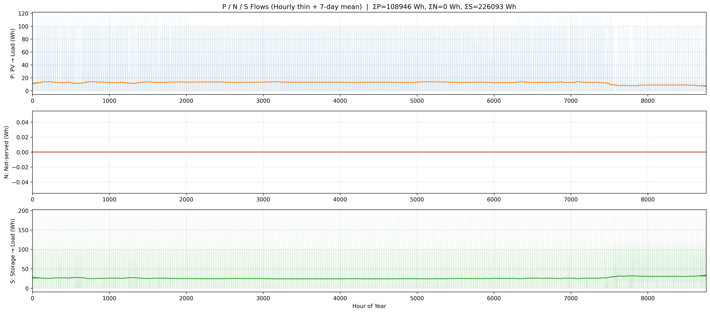
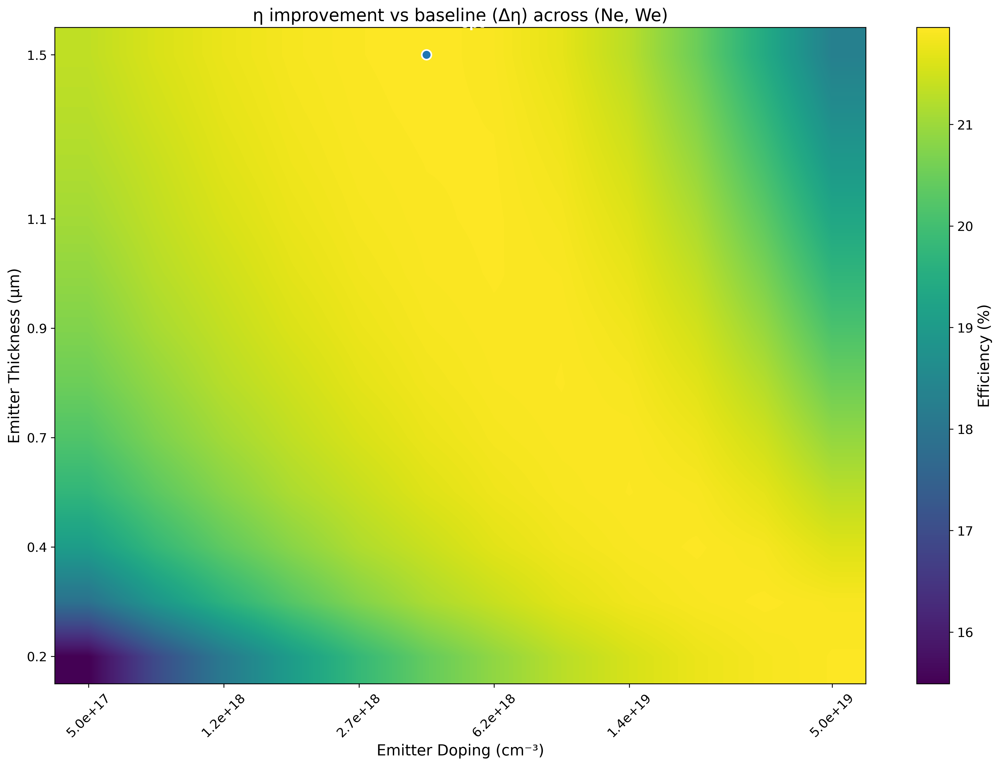
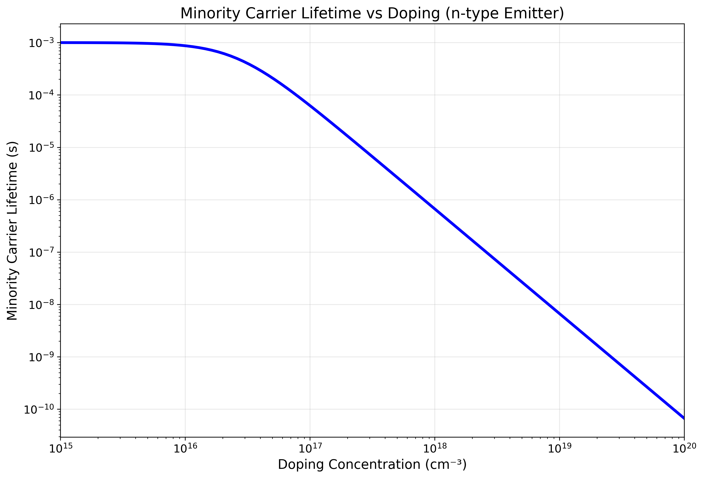
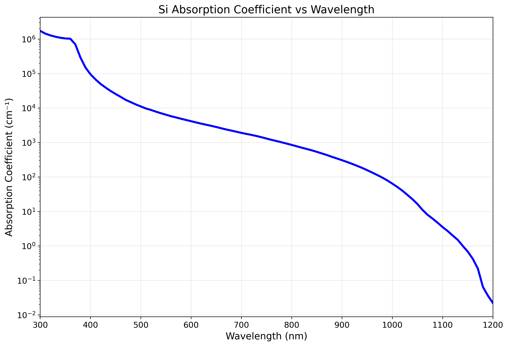
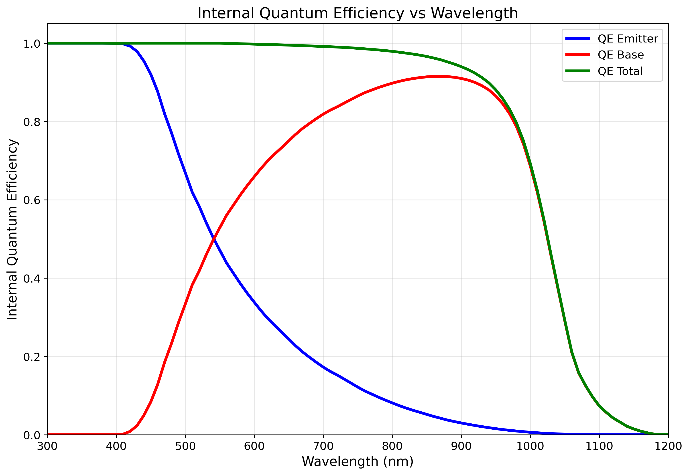

# Photovoltaic Energy Conversion

> Hourly techno-economic model comparing net metering vs. net billing for residential solar-plus-storage

     



### 🌐 Live project page → **https://selsaady1.github.io/eee591-photovoltaic-final-project/**

## Overview
An EEE 591 (Photovoltaic Energy Conversion, ASU) final project that models a 5 kW residential PV system paired with a 14 kWh battery and evaluates its economics under two utility billing policies: net metering and net billing. Using an 8,760-hour (full-year) simulation with Salt River Project time-of-use rates, it quantifies annual electricity costs, net present value, levelized cost of energy, and payback period to assess whether home solar-plus-storage is financially viable under current Arizona rate structures.

**Highlight:** 51.3% annual bill reduction under net metering ($1,832.55 to $892.78)

**Highlight:** 51.3% annual bill reduction under net metering ($1,832.55 to $892.78)

## Key Achievements
- Built a full 8,760-hour simulation in Python: time-of-use rate construction across three seasons, an hour-by-hour battery dispatch model (10-100% SOC, 95% charge/discharge efficiency), and grid import/export accounting
- Implemented financial-engineering methods from scratch: NPV discounting, capital-recovery annualization, and a geometric-series NPV for O&M growth, including a 7-year battery replacement schedule over a 25-year horizon
- Found net metering reduces the $1,832.55 baseline annual bill to $892.78 (15.1-year payback) vs. $920.72 for net billing (15.6-year payback), with both yielding negative 25-year NPV (-$7,572 and -$8,059) at a 3% discount rate
- Ran a battery-cost sensitivity analysis (±25% around $300/kWh) showing each $75/kWh change shifts NPV by ~$3,162, and estimated net metering would need battery costs below ~$150/kWh to reach a positive NPV
- Generated the figure set (load profile, summer/winter energy flows, battery SOC, bill and economics comparisons) that supports the IEEE-style report

## Approach
The analysis was implemented in Python with NumPy and Pandas for the hourly simulation and Matplotlib for figures. The pipeline loads 8,760-hour load and PV-production CSVs, builds a time-of-use rate array from SRP seasonal/peak definitions, dispatches the battery hour-by-hour to maximize self-consumption, then computes annual bills under each policy and runs the financial model (NPV, annualized cost, LCOE, payback) plus a battery-cost sensitivity sweep. Results are written up in an IEEE-style report with abstract, methodology, results, and conclusion.

## Tools & Technologies
- Python
- NumPy
- Pandas
- Matplotlib
- CSV (8760-hour load/PV data)

## Gallery





## Repository Structure
```
.gitignore
.nojekyll
LICENSE
README.md
data/Elsaady_MiniProject1_EEE598.zip
data/README.md
docs/EEE591_PracticeProblemSet1_Elsaady.pdf
docs/EEE591_PraticeProblemSet4Elsaady.pdf
docs/EEE591_Project_Paper-1.docx.pdf
docs/EEE_465_591_Solar_Cell_Mini_Project_2_Saif_Elsaady_-2.pdf
docs/EEE_591_mini_project4-3.pdf
docs/Elsaady_Mini_Project_3_EEE_465_591-1.pdf
docs/Elsaady_PhotovoltaicsPracticeProblem3.pdf
docs/Elsaady_PracticeProblem8.pdf
docs/Elsaady_Practice_Problem7.pdf
docs/Mini_Project_1_-_Solar_Radiation_Analysis.pdf
docs/Residential-Grid-Connected-PV-Battery-System-Net-Metering-vs-Net-Billi
images/fig1.png
images/fig2.png
images/fig3.png
images/fig4.png
images/fig5.png
images/fig6.png
images/preview.png
index.html
src/Elsaady_FinalProject_EEE591.py
src/Elsaady_MiniProject4.py
src/Elsaady_Project_3_code_snippet_F21.py
src/Elsaadycell_simulator_F24-3.py
src/MiniProject1_Elsaady.py
```

## Results
Both policies cut the annual bill by roughly 49-51% (net metering to $892.78, net billing to $920.72) but neither is economically viable under current Arizona rates: 25-year net NPV is -$7,572 (net metering) and -$8,059 (net billing), payback is 15.1-15.6 years, and LCOE is $0.0956/kWh; net metering holds a ~$487 lifetime NPV advantage. Full details are in docs/EEE591_Project_Paper-1.docx.pdf.

## Deliverable
See [`docs/EEE591_Project_Paper-1.docx.pdf`](docs/EEE591_Project_Paper-1.docx.pdf).

## License
MIT — see [`LICENSE`](LICENSE).

---
_Part of [Saif Elsaady's engineering portfolio](https://selsaady1.github.io/portfolio/). Deliverables only — routine homework/quizzes/exams excluded._