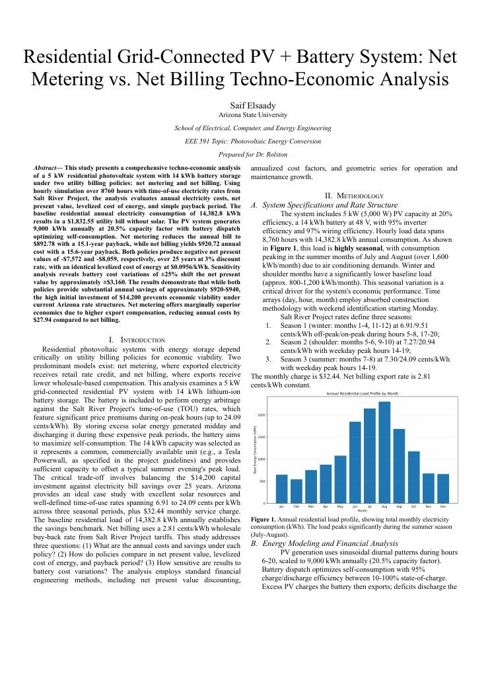

# Photovoltaic Energy Conversion — Final Project

> Coursework project from **Fall 2025 EEE 465/591: Photovoltaic Energy Conversion** (2025 Fall C).

**Course:** Fall 2025 EEE 465/591: Photovoltaic Energy Conversion — 2025 Fall C  ·  **Area:** energy, software

## Overview
This repository contains my submitted deliverables for the project below. The course assignment brief (verbatim, abbreviated):

> Final Project EEE 465_591.docx - These are just suggestions, you are encouraged to select any alternative topic as long as it relates to photovoltaics in some way! You are welcome to work alone or in groups of up to 4 people for this project! Sign up for final presentation times (and to upload your presentation itself) here- https://docs.google.com/spreadsheets/d/1T_-4RJbTYBrqHLA6bU3e-eIvjwTawuSl2ixEbZmHBK8/edit?usp=sharing Final Presentation Grading Guidelines.docx   Formatting Guidelines for Final Report (591) - Aim for sections that include: abstract, introduction, results/discussion (with figures), conclusion, and references. Total length should be 2 pages or longer.   Some more informat

## Tools & Tech
- PDF report
- Python

## Repository Structure
```
data/Elsaady_MiniProject1_EEE598.zip
docs/EEE591_PracticeProblemSet1_Elsaady.pdf
docs/EEE591_PraticeProblemSet4Elsaady.pdf
docs/EEE591_Project_Paper-1.docx.pdf
docs/EEE_465_591_Solar_Cell_Mini_Project_2_Saif_Elsaady_-2.pdf
docs/EEE_591_mini_project4-3.pdf
docs/Elsaady_Mini_Project_3_EEE_465_591-1.pdf
docs/Elsaady_PhotovoltaicsPracticeProblem3.pdf
docs/Elsaady_PracticeProblem8.pdf
docs/Elsaady_Practice_Problem7.pdf
docs/Mini_Project_1_-_Solar_Radiation_Analysis.pdf
docs/Residential-Grid-Connected-PV-Battery-System-Net-Metering-vs-Net-Billi
images/preview.png
src/Elsaady_FinalProject_EEE591.py
src/Elsaady_MiniProject4.py
src/Elsaady_Project_3_code_snippet_F21.py
src/Elsaadycell_simulator_F24-3.py
src/MiniProject1_Elsaady.py
```

## Exploring the Code
- Python scripts are in `src/`.
- _Not independently re-run here; provided as submitted._

## Results
See the report(s)/presentation(s) in `docs/` — e.g. `docs/EEE591_Project_Paper-1.docx.pdf`.

## Preview


## License
Released under the MIT License — see `LICENSE`.

---
_Part of my engineering coursework portfolio. Deliverables only; routine homework, quizzes, and exams are intentionally excluded._